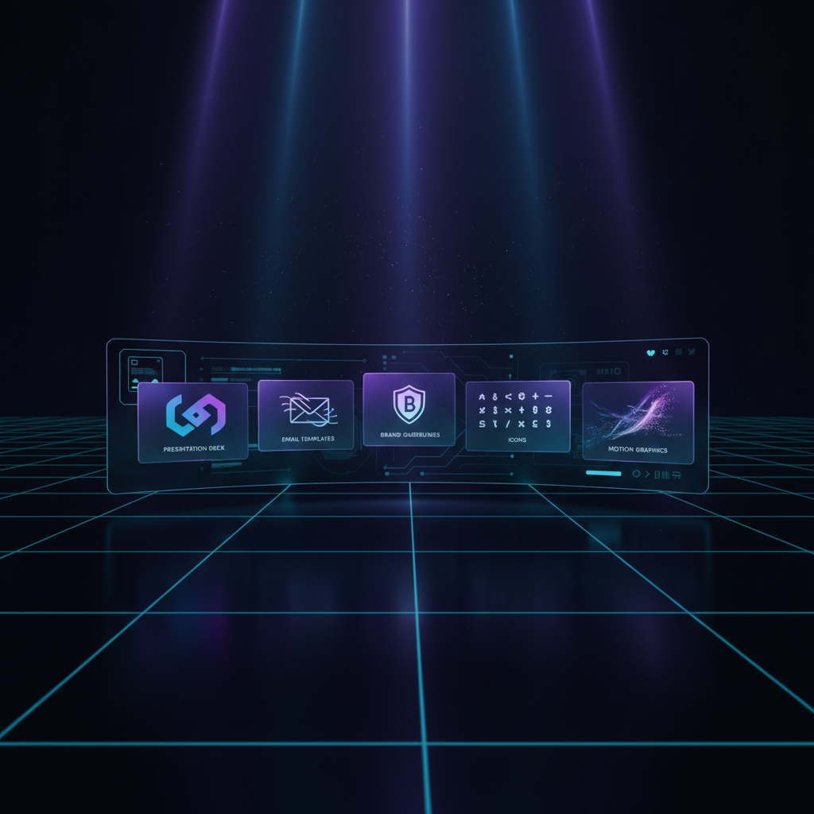

<p align="center">
  
</p>

<h1 align="center">DigiForge</h1>

<p align="center">
  <strong>AI-Powered Digital Product Studio</strong><br/>
  Generate professional digital assets in seconds — pitch decks, email templates, brand kits, icon packs, and more.
</p>

<p align="center">
  
  
  
  
</p>

---

## What is this?

DigiForge is a demo application that replaces manual creative agency work with AI-powered agents. Pick a digital product type, provide minimal inputs, and an AI agent generates a complete, professional, downloadable asset in seconds.

Each product type is a **skill** — a self-contained AI agent with its own prompt, input schema, and output pipeline. The system is templateized: adding a new product type means adding one file.

## Skills

| Skill | Difficulty | Output | Description |
|-------|-----------|--------|-------------|
| Prompt Guide Generator | Easy | HTML | Step-by-step AI prompt guides for any platform |
| Email Template Pack | Easy | HTML | Professional responsive email templates |
| Content Calendar | Easy | HTML | Social media calendars with post ideas and hashtags |
| Proposal Deck | Medium | PPTX | Pitch decks with AI-generated images and business diagrams |
| Brand Guidelines Kit | Medium | HTML | Comprehensive brand identity guides |
| Icon Pack Generator | Hard | SVG/HTML | Consistent icon sets generated by AI |
| Motion Graphics Library | Hard | SVG/HTML | CSS-animated SVG motion graphics |

## Architecture

```
User fills form  -->  Orchestrator (TypeScript)  -->  Skill Agent (Claude)
                                                         |
                                                    [Tools: fetch_image, create_diagram]
                                                         |
                                                    Output Pipeline  -->  Preview + Download
                                                         |
                                              SSE Streaming  -->  Real-time progress UI
```

- **Orchestrator**: Pure TypeScript routing — no AI for dispatch, just a `Map.get()`
- **Skill Registry**: Each skill is a config object (Zod schema + system prompt + output pipeline)
- **Agent Mode**: Advanced skills (Proposal Deck) use the Claude Agent SDK with MCP tools
- **Job Store**: In-memory store with SSE streaming for real-time progress updates
- **Image Generation**: Gemini 2.5 Flash Image (Nano Banana) for slide visuals
- **Diagram Engine**: Programmatic SVG business diagrams (timelines, process flows, metrics, funnels, pyramids)

## Tech Stack

| Layer | Technology |
|-------|-----------|
| Framework | Next.js 16 (App Router, Turbopack) |
| Language | TypeScript |
| AI Agent | Claude Agent SDK + Anthropic SDK |
| Image Gen | Gemini 2.5 Flash Image (Nano Banana) |
| UI | shadcn/ui + Tailwind CSS |
| PPTX | pptxgenjs |
| Validation | Zod |
| Icons | Lucide React |

## Getting Started

### Prerequisites

- Node.js 18+
- Anthropic API key
- Google AI API key (for image generation in Proposal Deck)

### Setup

```bash
git clone https://github.com/ArkMaster123/hyperfilmdemo.git
cd hyperfilmdemo
npm install
```

Create `.env.local`:

```env
ANTHROPIC_API_KEY=your-anthropic-api-key
GOOGLE_AI_API_KEY=your-google-ai-api-key
```

### Run

```bash
npm run dev
```

Open [http://localhost:3000](http://localhost:3000)

## How It Works

1. **Pick a product** — Landing page shows all 7 skills as cards
2. **Fill the form** — Each skill has a dynamic form rendered from its Zod schema
3. **Magic Fill** — Click the wand button to auto-complete empty fields with AI
4. **Generate** — Hit Generate, watch real-time streaming progress
5. **Preview** — See the output rendered in-browser
6. **Download** — Get the real file (HTML, PPTX, SVG)

## Adding a New Skill

Create one file at `src/lib/skills/your-skill.ts`:

```typescript
import { z } from 'zod';
import { SkillConfig } from './types';
import { createHtmlOutput } from '../output/html-pipeline';

const inputSchema = z.object({
  topic: z.string().describe('What to generate'),
  style: z.enum(['professional', 'creative']).describe('Style'),
});

export const yourSkill: SkillConfig = {
  id: 'your-skill',
  name: 'Your Skill',
  description: 'What it does',
  difficulty: 'easy',
  icon: 'FileText',
  category: 'Category',
  inputSchema,
  systemPrompt: 'You are an expert at...',
  outputFormat: 'html',
  outputPipeline: createHtmlOutput,
};
```

Register it in `src/lib/skills/registry.ts` and add a card in `src/lib/skills.ts`. Done.

## Project Structure

```
src/
  app/
    api/
      generate/        POST — start generation
      stream/[jobId]/  GET  — SSE progress stream
      download/[jobId] GET  — file download
      autofill/        POST — magic fill form fields
      skills/          GET  — list skills + schemas
    skill/[skillId]/   Skill generation page
    page.tsx           Landing page
  lib/
    skills/            Skill configs (one file per product type)
    engine/            Orchestrator, executor, job store
    output/            Output pipelines (HTML, PPTX)
    services/          Image gen, diagram engine, deck tools
  components/          UI components (grid, form, progress, preview)
```

## Credits

- AI Generation: [Anthropic Claude](https://anthropic.com)
- Image Generation: [Google Gemini](https://ai.google.dev)
- UI Components: [shadcn/ui](https://ui.shadcn.com)
- PPTX Engine: [pptxgenjs](https://github.com/gitbrent/PptxGenJS)

